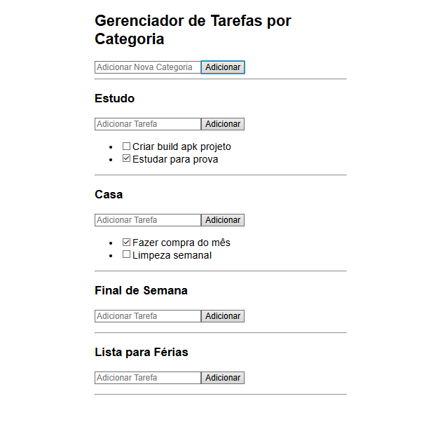

# 📋 Gerenciador de Tarefas por Categoria

Uma aplicação React simples e funcional para organização de tarefas agrupadas por categorias personalizadas, como **Trabalho**, **Estudos**, **Pessoal**, entre outras.

---

## 🚀 Funcionalidades

- ✅ Adicionar categorias personalizadas
- 📝 Adicionar tarefas dentro de cada categoria
- 🔁 Marcar tarefas como concluídas
- 📂 Visualizar tarefas organizadas por categoria

---

## 🧱 Estrutura do Projeto

```bash
src/
├── components/
│   ├── AddCategory.js      # Formulário para criar nova categoria
│   ├── AddTask.js          # Formulário para adicionar tarefa à categoria
│   ├── CategoryList.js     # Exibe todas as categorias cadastradas
│   └── TaskList.js         # Lista as tarefas de uma categoria
├── context/
│   └── TaskContext.js      # Contexto global com dados e funções
├── App.js                  # Componente principal da aplicação
└── index.js                # Ponto de entrada do React

⚙️ Como rodar o projeto localmente

1. Clone este repositório
bash
Copy
Edit
git clone https://github.com/seu-usuario/nome-do-repositorio.git
cd nome-do-repositorio

2. Instale as dependências
bash
Copy
Edit
npm install

3. Inicie o servidor de desenvolvimento
bash
Copy
Edit
npm start
Acesse em: http://localhost:3000

📦 Tecnologias utilizadas
React

React Context API

JavaScript (ES6+)

HTML5 & CSS3 (estilização básica inline)

🧠 Organização do Código

A aplicação foi desenvolvida com base no paradigma de componentes funcionais do React e utiliza Context API para gerenciar o estado global (categorias e tarefas). Cada categoria possui sua própria lista de tarefas, e cada tarefa pode ser marcada como concluída.

📌 Objetivo Acadêmico

Este projeto foi desenvolvido como parte da disciplina Laboratório de Desenvolvimento Web da Faculdade de Tecnologia de Jacareí — FATEC. Seu propósito é demonstrar o uso prático de React.js com foco em gerenciamento de estado e componentização.

📸 Exemplo de uso

